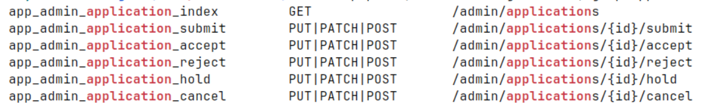
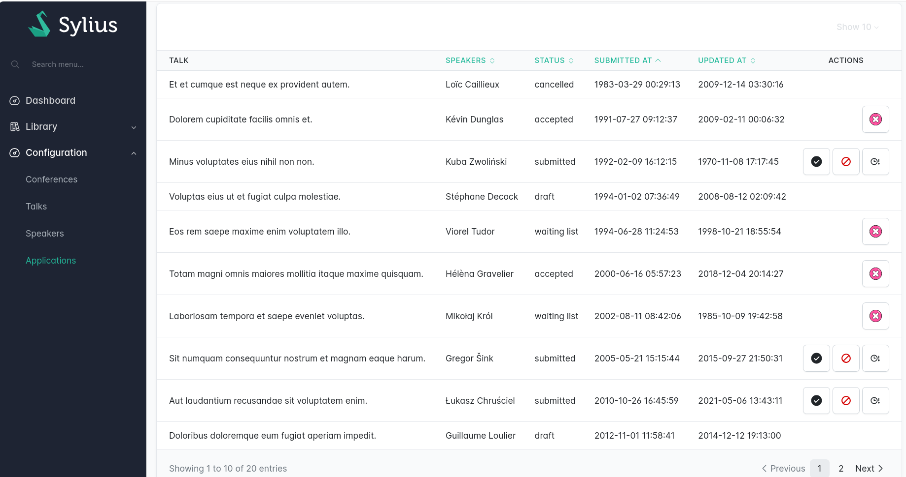

# State machine transitions cookbook

The Sylius Stack lets you leverage [Symfony Workflow](https://symfony.com/doc/current/workflow.html) to apply **state machine transitions** 
directly from your grids or Twig templates using `actions`. If you're not familiar with workflows and state 
machines in Symfony, read [this article](https://symfony.com/doc/current/workflow/workflow-and-state-machine.html).

## Install Symfony Workflow

You need to install [Symfony Workflow](https://symfony.com/doc/current/workflow.html)

````bash
composer require symfony/workflow
````

## Example workflow configuration 

Then, you need to set up your own workflow. In this example, we will assume a speaker can submit an application for a
talk at a conference (the famous "Call for Papers" !).

An application for a talk starts a `draft`, then it can be `submitted` by the speaker.

In this admin interface, we will "allow" admin users to either : 

- `accept` an application
- `reject` an application
- put an application on a` waiting list`
- `cancel` an application (this action could possibly be done by the speaker themselves too if they couldn't make it anymore to the conference event)

### Symfony workflow config

We therefore need to register our config. This is done in `config/packages/workflow.yaml`.

For the purpose of this example, we've placed the config in a separate PHP file, which we then imported in
`config/packages/workflow.yaml` this way : 


```yaml
imports:
    - { resource: '../workflows/**/*.php' }

framework:
    workflows: null
```



```php
<?php

declare(strict_types=1);

use App\Entity\Application;
use App\Enum\ApplicationStatus;
use Symfony\Component\DependencyInjection\Loader\Configurator\ContainerConfigurator;

return static function (ContainerConfigurator $containerConfigurator): void {
    $containerConfigurator->extension('framework', [
        'workflows' => [
            'application' => [
                'type' => 'state_machine',
                 'initial_marking' => ApplicationStatus::DRAFT->value,
                'marking_store' => [
                    'property' => 'status',
                ],
                'supports' => [
                    Application::class,
                ],
                'audit_trail' => [
                    'enabled' => true,
                ],
                'places' => [
                    ApplicationStatus::SUBMITTED->value,
                    ApplicationStatus::ACCEPTED->value,
                    ApplicationStatus::REJECTED->value,
                    ApplicationStatus::WAITING_LIST->value,
                    ApplicationStatus::CANCELLED->value,
                ],
                'transitions' => [
                    'submit' => [
                        'from' => ApplicationStatus::DRAFT->value,
                        'to' => ApplicationStatus::SUBMITTED->value,
                    ],
                    'accept' => [
                        'from' => ApplicationStatus::SUBMITTED->value,
                        'to' => ApplicationStatus::ACCEPTED->value,
                    ],
                    'reject' => [
                        'from' => ApplicationStatus::SUBMITTED->value,
                        'to' => ApplicationStatus::REJECTED->value,
                    ],
                    'hold' => [
                        'from' => ApplicationStatus::SUBMITTED->value,
                        'to' => ApplicationStatus::WAITING_LIST->value,
                    ],
                    'cancel' => [
                        'from' => [ApplicationStatus::ACCEPTED->value, ApplicationStatus::WAITING_LIST->value],
                        'to' => ApplicationStatus::CANCELLED->value,
                    ],
                ],
            ],
        ],
    ]);
};
```


### Create a Resource and Grid

Now, we need to create a Sylius resource and a Sylius grid to manage our `Applications`.

First, let's create an `Application` resource : 


```php
<?php

declare(strict_types=1);

namespace App\Entity;

use App\Enum\ApplicationStatus;
use App\Grid\ApplicationGrid;
use App\Repository\ApplicationRepository;
use Doctrine\ORM\Mapping as ORM;
use Sylius\Component\Resource\Model\ResourceInterface;
use Sylius\Resource\Metadata\AsResource;
use Sylius\Resource\Metadata\Index;

#[ORM\Entity(repositoryClass: ApplicationRepository::class)]
#[AsResource(
    section: 'admin',
    templatesDir: '@SyliusAdminUi/crud',
    routePrefix: '/admin',
    operations: [
        new Index(grid: ApplicationGrid::class),
    ],
)]
class Application implements ResourceInterface
{
    #[ORM\Id]
    #[ORM\GeneratedValue]
    #[ORM\Column]
    private ?int $id = null;

    #[ORM\Column]
    private ?\DateTimeImmutable $submittedAt = null;

    #[ORM\OneToOne(inversedBy: 'application', cascade: ['persist', 'remove'])]
    #[ORM\JoinColumn(nullable: false)]
    private ?Talk $talk = null;

    #[ORM\Column(enumType: ApplicationStatus::class)]
    private ?ApplicationStatus $status = null;

    #[ORM\Column]
    private ?\DateTimeImmutable $updatedAt = null;

    public function getId(): ?int
    {
        return $this->id;
    }

    public function getSubmittedAt(): ?\DateTimeImmutable
    {
        return $this->submittedAt;
    }

    public function setSubmittedAt(\DateTimeImmutable $submittedAt): static
    {
        $this->submittedAt = $submittedAt;

        return $this;
    }

    public function getTalk(): ?Talk
    {
        return $this->talk;
    }

    public function setTalk(Talk $talk): static
    {
        $this->talk = $talk;

        return $this;
    }

    public function getStatus(): ?ApplicationStatus
    {
        return $this->status;
    }

    public function setStatus(ApplicationStatus $status): static
    {
        $this->status = $status;

        return $this;
    }

    public function getUpdatedAt(): ?\DateTimeImmutable
    {
        return $this->updatedAt;
    }

    public function setUpdatedAt(\DateTimeImmutable $updatedAt): static
    {
        $this->updatedAt = $updatedAt;

        return $this;
    }
}
```


The resource is linked up to a standard Sylius Grid : 


```php
<?php

/*
 * This file is part of the Sylius package.
 *
 * (c) Sylius Sp. z o.o.
 *
 * For the full copyright and license information, please view the LICENSE
 * file that was distributed with this source code.
 */

declare(strict_types=1);

namespace App\Grid;

use App\Entity\Application;
use App\Entity\Conference;
use App\Enum\ApplicationStatus;
use App\Grid\Filter\SpeakerFilter;
use Sylius\Bundle\GridBundle\Builder\Action\ApplyTransitionAction;
use Sylius\Bundle\GridBundle\Builder\Field\DateTimeField;
use Sylius\Bundle\GridBundle\Builder\Field\EnumField;
use Sylius\Bundle\GridBundle\Builder\Field\StringField;
use Sylius\Bundle\GridBundle\Builder\Field\TwigField;
use Sylius\Bundle\GridBundle\Builder\Filter\DateFilter;
use Sylius\Bundle\GridBundle\Builder\Filter\EntityFilter;
use Sylius\Bundle\GridBundle\Builder\Filter\EnumFilter;
use Sylius\Bundle\GridBundle\Builder\Filter\Filter;
use Sylius\Bundle\GridBundle\Builder\Filter\StringFilter;
use Sylius\Bundle\GridBundle\Builder\GridBuilderInterface;
use Sylius\Component\Grid\Attribute\AsGrid;

#[AsGrid(
    resourceClass: Application::class,
    name: 'app_application',
)]
final class ApplicationGrid
{
    public function __invoke(GridBuilderInterface $gridBuilder): void
    {
        $gridBuilder
            ->withFilters(
                EntityFilter::create(name: 'conference', resourceClass: Conference::class, fields: ['talk.conference'])
                    ->setLabel('app.ui.conference')
                    ->addFormOption('choice_label', 'name'),
                Filter::create(name: 'speaker', type: SpeakerFilter::class)
                    ->setLabel('app.ui.speaker')
                    ->setOptions(['fields' => ['talk.speakers.id']]),
                StringFilter::create('search', ['talk.title'])
                    ->setLabel('sylius.ui.search'),
                EnumFilter::create(name: 'status', enumClass: ApplicationStatus::class, field: 'status')
                    ->addFormOption('choice_value', fn (?ApplicationStatus $enum) => $enum?->value)
                    ->addFormOption('choice_label', fn (ApplicationStatus $choice) => ucfirst($choice->value))
                    ->setLabel('app.ui.status'),
                DateFilter::create('submittedAt')
                    ->setLabel('app.ui.submitted_at'),
            )
            ->withFields(
                StringField::create('talk.title')
                    ->setLabel('app.ui.talk'),
                TwigField::create(name: 'talk.speakers', template: 'talk/grid/field/speakers.html.twig')
                    ->setLabel('app.ui.speakers')
                    ->setSortable(true),
                EnumField::create('status')
                    ->setLabel('app.ui.status')
                    ->setSortable(true),
                DateTimeField::create('submittedAt')
                    ->setLabel('app.ui.submitted_at')
                    ->setSortable(true),
                DateTimeField::create('updatedAt')
                    ->setLabel('app.ui.updated_at')
                    ->setSortable(true),
            )
    }
}
```



### State machine transition operations

To enable your state machine transitions, you need to add an `ApplyStateMachineTransition` operation for each of 
the operations you want to enable on your Resource.


```php
<?php

/*
 * This file is part of the Sylius package.
 *
 * (c) Sylius Sp. z o.o.
 *
 * For the full copyright and license information, please view the LICENSE
 * file that was distributed with this source code.
 */

declare(strict_types=1);

namespace App\Entity;

use App\Enum\ApplicationStatus;
use App\Grid\ApplicationGrid;
use App\Repository\ApplicationRepository;
use Doctrine\ORM\Mapping as ORM;
use Sylius\Component\Resource\Model\ResourceInterface;
use Sylius\Resource\Metadata\ApplyStateMachineTransition;
use Sylius\Resource\Metadata\AsResource;
use Sylius\Resource\Metadata\Index;

#[ORM\Entity(repositoryClass: ApplicationRepository::class)]
#[AsResource(
    section: 'admin',
    templatesDir: '@SyliusAdminUi/crud',
    routePrefix: '/admin',
    operations: [
        new Index(grid: ApplicationGrid::class),
        new ApplyStateMachineTransition(stateMachineTransition: 'submit'), // transition names are defined in your workflow config file
        new ApplyStateMachineTransition(stateMachineTransition: 'accept'),
        new ApplyStateMachineTransition(stateMachineTransition: 'reject'),
        new ApplyStateMachineTransition(stateMachineTransition: 'hold'),
        new ApplyStateMachineTransition(stateMachineTransition: 'cancel'),
    ],
)]
class Application implements ResourceInterface
{
    #[ORM\Column(enumType: ApplicationStatus::class)]
    private ?ApplicationStatus $status = null;
    
    // ...
}
```


This will generate the necessary routes. Let's make sure our routes are properly enabled : 

```bash
symfony console debug:router | grep application
```

<figure></figure>


### State machine transition actions

#### Actions in Grids

Once the operation has been added to your Resource, you can simply add an `ApplyTransitionAction` button on your grid.


```php
<?php

/*
 * This file is part of the Sylius package.
 *
 * (c) Sylius Sp. z o.o.
 *
 * For the full copyright and license information, please view the LICENSE
 * file that was distributed with this source code.
 */

declare(strict_types=1);

namespace App\Grid;

use App\Entity\Application;
use Sylius\Bundle\GridBundle\Builder\Action\ApplyTransitionAction;
use Sylius\Bundle\GridBundle\Builder\GridBuilderInterface;
use Sylius\Component\Grid\Attribute\AsGrid;

#[AsGrid(
    resourceClass: Application::class,
    name: 'app_application',
)]
final class ApplicationGrid
{
    public function __invoke(GridBuilderInterface $gridBuilder): void
    {
        $gridBuilder
            // ...
            ->withItemActions(
                ApplyTransitionAction::create(name: 'accept', route: 'app_admin_application_accept')
                    ->setIcon('ep:success-filled')
                    ->setLabel('app.ui.accept'),
                ApplyTransitionAction::create(name: 'reject', route: 'app_admin_application_reject')
                    ->setIcon('flat-color-icons:cancel')
                    ->setLabel('app.ui.reject'),
                ApplyTransitionAction::create(name: 'hold', route: 'app_admin_application_hold')
                    ->setIcon('iconmind:wait-approval-outline-thin')
                    ->setLabel('app.ui.hold'),
                ApplyTransitionAction::create(name: 'cancel', route: 'app_admin_application_cancel')
                    ->setIcon('streamline-stickies-color:cancel-2')
                    ->setLabel('app.ui.cancel'),
            );
    }
}
```



The Sylius Stack will automatically enable your state machine transition action if the action can be executed according to 
the workflow configuration you set up.

<figure></figure>

#### Actions in Twig templates

You can also include your transition button actions in any Twig template by leveraging the `workflow_can` function. The button
will only be generated when your Symfony Workflow config allows it.


```twig

    <form method="post" action="{{ path('app_admin_application_cancel', {id: application.id}) }}">
        <input type="hidden" name="_token"
               value="{{ csrf_token('apply_transition') }}">
        <button type="submit" class="btn btn-icon"
                data-bs-toggle="tooltip"
                data-bs-placement="right"
                data-bs-title="{{ 'app.ui.application.cancel'|trans }}"
        >
            {{ ux_icon('streamline-stickies-color:cancel-2') }}
        </button>
    </form>

```

